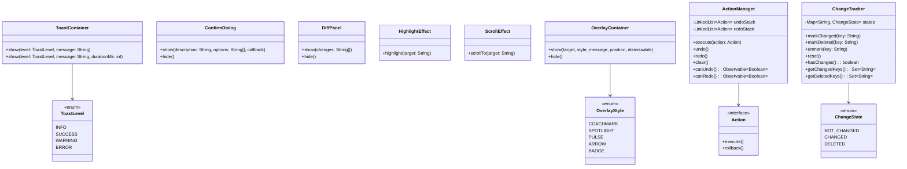

# UI-Components 클래스 다이어그램

```mermaid
classDiagram
    class ToastLevel {
        <<enum>>
        INFO
        SUCCESS
        WARNING
        ERROR
    }

    class OverlayStyle {
        <<enum>>
        COACHMARK
        SPOTLIGHT
        PULSE
        ARROW
        BADGE
    }

    class ToastContainer {
        +show(level: ToastLevel, message: String)
        +show(level: ToastLevel, message: String, durationMs: int)
    }

    class ConfirmDialog {
        +show(description: String, options: String[], callback)
        +hide()
    }

    class DiffPanel {
        +show(changes: String[])
        +hide()
    }

    class HighlightEffect {
        +highlight(target: String)
    }

    class ScrollEffect {
        +scrollTo(target: String)
    }

    class OverlayContainer {
        +show(target, style, message, position, dismissable)
        +hide()
    }

    class Action {
        <<interface>>
        +execute()
        +rollback()
    }

    class ActionManager {
        -LinkedList~Action~ undoStack
        -LinkedList~Action~ redoStack
        +execute(action: Action)
        +undo()
        +redo()
        +clear()
        +canUndo(): Observable~Boolean~
        +canRedo(): Observable~Boolean~
    }

    class ChangeTracker {
        -Map~String, ChangeState~ states
        +markChanged(key: String)
        +markDeleted(key: String)
        +unmark(key: String)
        +reset()
        +hasChanges(): boolean
        +getChangedKeys(): Set~String~
        +getDeletedKeys(): Set~String~
    }

    class ChangeState {
        <<enum>>
        NOT_CHANGED
        CHANGED
        DELETED
    }

    ToastContainer --> ToastLevel
    OverlayContainer --> OverlayStyle
    ActionManager --> Action
    ChangeTracker --> ChangeState
```
