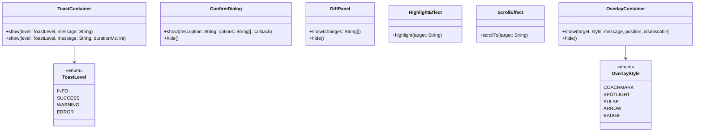

# UI-Components 클래스 다이어그램

```mermaid
classDiagram
    class ToastLevel {
        <<enum>>
        INFO
        SUCCESS
        WARNING
        ERROR
    }

    class OverlayStyle {
        <<enum>>
        COACHMARK
        SPOTLIGHT
        PULSE
        ARROW
        BADGE
    }

    class ToastContainer {
        +show(level: ToastLevel, message: String)
        +show(level: ToastLevel, message: String, durationMs: int)
    }

    class ConfirmDialog {
        +show(description: String, options: String[], callback)
        +hide()
    }

    class DiffPanel {
        +show(changes: String[])
        +hide()
    }

    class HighlightEffect {
        +highlight(target: String)
    }

    class ScrollEffect {
        +scrollTo(target: String)
    }

    class OverlayContainer {
        +show(target, style, message, position, dismissable)
        +hide()
    }

    ToastContainer --> ToastLevel
    OverlayContainer --> OverlayStyle
```
