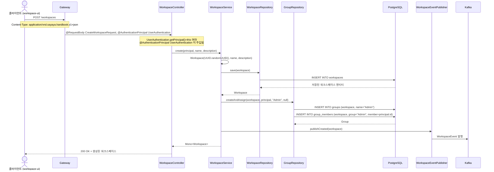
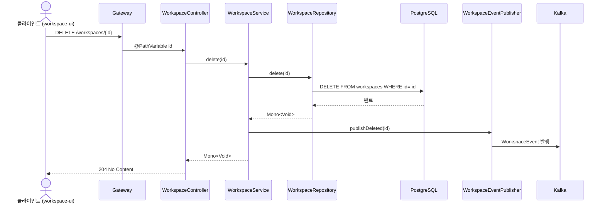
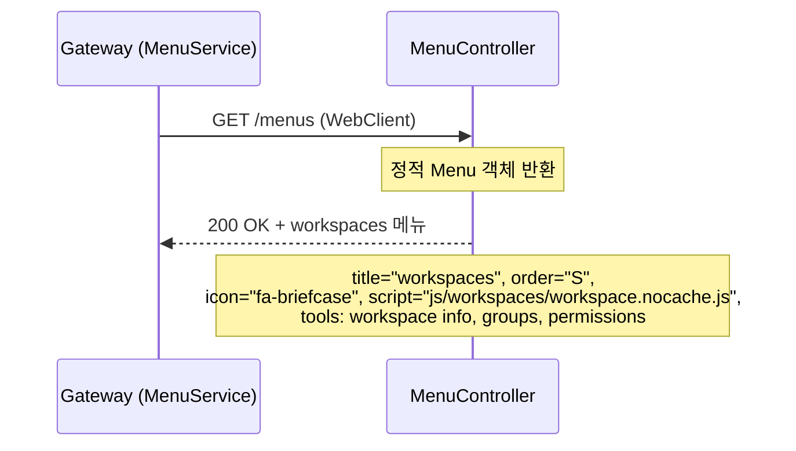
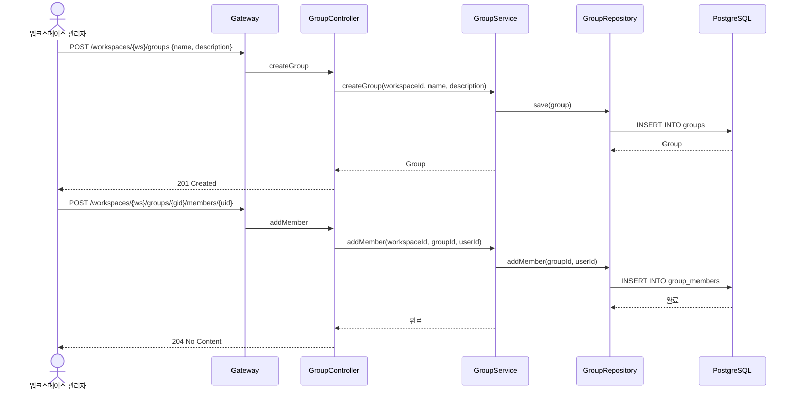
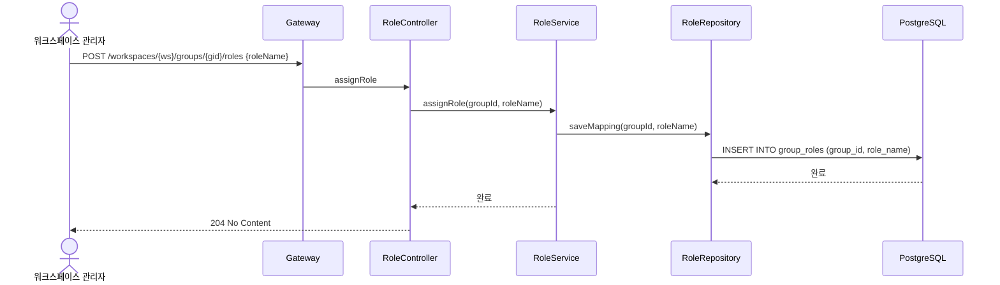
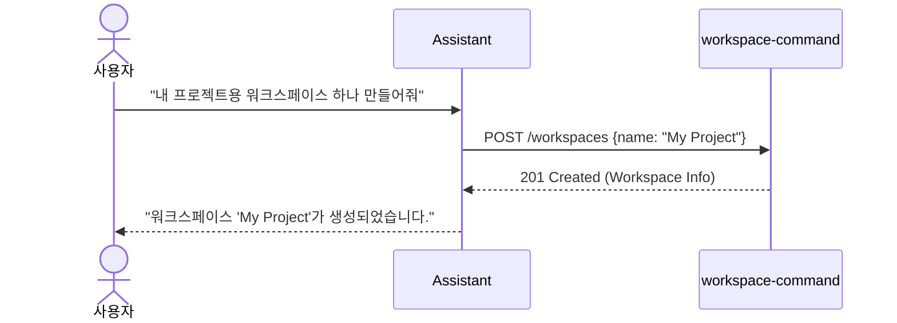

# Persist-Workspace 유스케이스

## 워크스페이스 생성 시퀀스

## 워크스페이스 삭제 시퀀스

## 메뉴 제공 시퀀스

## 그룹 및 멤버 관리 시퀀스

## 역할 부여 시퀀스

---

## UC-PW1: 워크스페이스 생성

| 항목 | 내용 |
|------|------|
| **액터** | 인증된 사용자 (workspace-ui 경유) |
| **선행조건** | 사용자가 인증된 상태 (JWT) |
| **정상 흐름** | 1. 클라이언트가 `POST /workspaces`로 name, description을 전송한다. 2. `WorkspaceController`가 `@AuthenticationPrincipal`로 인증된 사용자를 추출한다. 3. `WorkspaceService.create()`가 새 UUID를 생성하고 `WorkspaceRepository.save()`로 워크스페이스를 저장한다. 4. `GroupRepository.createAndAssign()`으로 "Admin" 그룹을 자동 생성하고, 생성자를 해당 그룹에 배정한다. 5. `WorkspaceEventPublisher.publishCreated()`로 생성 이벤트를 Kafka에 발행한다. 6. 생성된 워크스페이스가 응답으로 반환된다. |
| **결과** | 200 OK + 생성된 워크스페이스 (Admin 그룹 자동 생성 및 생성자 배정 완료) |

## UC-PW2: 워크스페이스 목록 조회

| 항목 | 내용 |
|------|------|
| **액터** | 인증된 사용자 |
| **선행조건** | 사용자가 인증된 상태 (JWT) |
| **정상 흐름** | 1. 클라이언트가 사용자가 참여 중인 워크스페이스 목록을 요청한다. 2. 인증 정보를 기반으로 사용자가 멤버로 속한 워크스페이스를 조회한다. 3. 워크스페이스 목록이 응답으로 반환된다. |
| **비고** | 현재 구현에서는 워크스페이스 목록 조회 전용 엔드포인트가 workspace-command 모듈에 없으며, `login` 모듈의 `/user` 엔드포인트에서 사용자 정보와 함께 제공될 수 있다 |
| **결과** | 사용자가 참여 중인 워크스페이스 목록 |

## UC-PW3: 워크스페이스 참여

| 항목 | 내용 |
|------|------|
| **액터** | 인증된 사용자 |
| **선행조건** | 대상 워크스페이스가 존재하고 참여 가능한 상태 |
| **정상 흐름** | 1. 클라이언트가 기존 워크스페이스에 참여를 요청한다. 2. 사용자가 해당 워크스페이스의 그룹에 멤버로 추가된다. 3. 참여 완료 후 워크스페이스 정보가 반환된다. |
| **비고** | 현재 구현에서는 `GroupRepository.createAndAssign()`이 워크스페이스 생성 시 Admin 그룹 배정에 사용되며, 기존 워크스페이스 참여(join) 전용 엔드포인트는 미구현 상태이다 |
| **결과** | 사용자가 워크스페이스에 참여됨 |

## UC-PW4: 워크스페이스 삭제

| 항목 | 내용 |
|------|------|
| **액터** | 워크스페이스 관리자 (workspace-ui 경유) |
| **선행조건** | 삭제 대상 워크스페이스가 존재 |
| **정상 흐름** | 1. 클라이언트가 `DELETE /workspaces/{id}`를 요청한다. 2. `WorkspaceController`가 `WorkspaceService.delete(id)`를 호출한다. 3. `WorkspaceRepository.delete()`로 워크스페이스를 삭제한다 (관련 데이터 cascade 삭제). 4. `WorkspaceEventPublisher.publishDeleted(id)`로 삭제 이벤트를 Kafka에 발행한다. 5. 204 No Content가 반환된다. |
| **결과** | 204 No Content |

## UC-PW5: 그룹 생성

| 항목 | 내용 |
|------|------|
| **액터** | 워크스페이스 관리자 |
| **선행조건** | `{workspace}:group:create` 권한 보유 |
| **정상 흐름** | 1. 관리자가 그룹명과 설명을 전송한다. 2. 이름 중복 여부를 확인한다. 3. 새 그룹을 저장한다. |
| **결과** | 201 Created |

## UC-PW6: 그룹 삭제

| 항목 | 내용 |
|------|------|
| **액터** | 워크스페이스 관리자 |
| **선행조건** | `{workspace}:group:delete` 권한 보유 |
| **정상 흐름** | 1. 관리자가 그룹 ID를 지정하여 삭제를 요청한다. 2. 해당 그룹과 멤버 매핑, 역할 매핑을 일괄 삭제한다. |
| **결과** | 204 No Content |

## UC-PW7: 멤버 배정

| 항목 | 내용 |
|------|------|
| **액터** | 워크스페이스 관리자 |
| **선행조건** | `{workspace}:user:assign` 권한 보유 |
| **정상 흐름** | 1. 관리자가 그룹 ID와 사용자 ID를 지정한다. 2. 해당 그룹에 사용자를 추가한다. (이미 존재하면 무시) |
| **결과** | 204 No Content |

## UC-PW8: 역할 부여

| 항목 | 내용 |
|------|------|
| **액터** | 워크스페이스 관리자 |
| **선행조건** | `{workspace}:role:assign` 권한 보유 |
| **정상 흐름** | 1. 관리자가 그룹 ID와 역할명을 지정한다. 2. `group_roles` 테이블에 매핑을 저장한다. |
| UC-PW8 (역할 부여) | 3.3 | 역할 부여 | RoleController, RoleService, RoleRepository | - |

---

## 에이전트 연동 시나리오

### UC-WS-A1: Assistant를 통한 워크스페이스 생성
사용자가 자연어로 워크스페이스 생성을 요청하면 Assistant가 `workspace-command`의 API를 직접 호출하여 생성한다. 생성 시 Admin 그룹 배정 등 후속 로직이 자동으로 수행된다.

---

## 트레이서빌리티 매트릭스

| UC | 요구사항 | 시퀀스 다이어그램 | 주요 클래스 | 테스트 |
|----|---------|---|---|---|
| UC-PW1 (생성) | 3.1 | 워크스페이스 생성 | WorkspaceController, WorkspaceService, WorkspaceRepository | - |
| UC-PW2 (목록) | 3.1 | — | workspace-query 측 담당 | - |
| UC-PW3 (참여) | 3.1 | — | WorkspaceService.join | - |
| UC-PW4 (삭제) | 3.1 | 워크스페이스 삭제 | WorkspaceController, WorkspaceService | - |
| UC-PW5 (그룹 생성) | 3.2 | 그룹 및 멤버 관리 | GroupController, GroupService, GroupRepository | - |
| UC-PW6 (그룹 삭제) | 3.2 | 그룹 및 멤버 관리 | GroupController, GroupService, GroupRepository | - |
| UC-PW7 (멤버 배정) | 3.2 | 그룹 및 멤버 관리 | GroupController, GroupService, GroupRepository | - |
| UC-PW8 (역할 부여) | 3.3 | 역할 부여 | RoleController, RoleService, RoleRepository | - |
| UC-WS-A1 (AI 생성) | 3.17 | UC-WS-A1 | Assistant, WorkspaceController | - |

