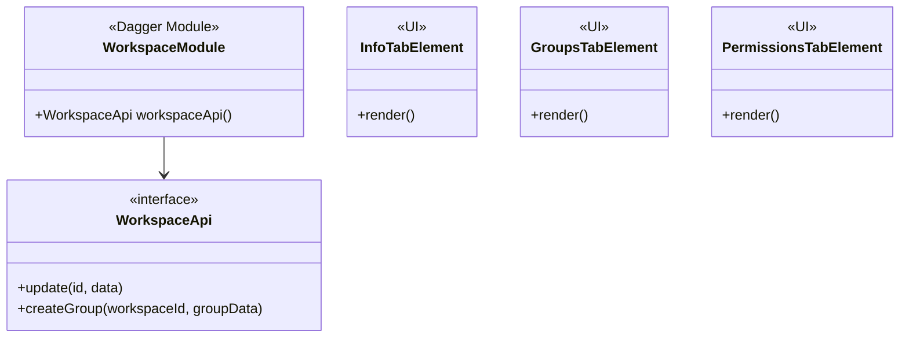

# Workspace-UI 클래스 다이어그램 (초안)

```mermaid
classDiagram
    class WorkspaceModule {
        <<Dagger Module>>
        +WorkspaceApi workspaceApi()
    }

    class WorkspaceApi {
        <<interface>>
        +update(id, data)
        +createGroup(workspaceId, groupData)
    }

    class InfoTabElement {
        <<UI>>
        +render()
    }

    class GroupsTabElement {
        <<UI>>
        +render()
    }

    class PermissionsTabElement {
        <<UI>>
        +render()
    }

    WorkspaceModule --> WorkspaceApi
```
*(추후 UI 설계가 확정되면 상세화됩니다)*
