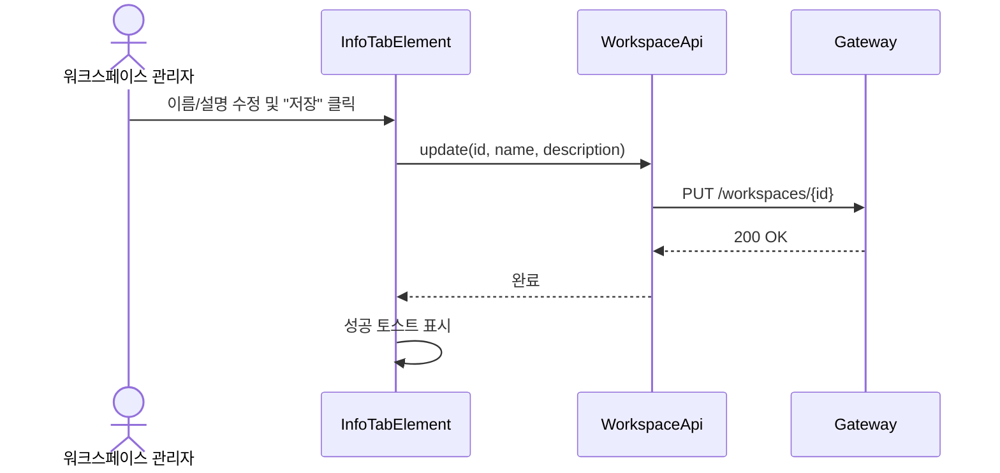
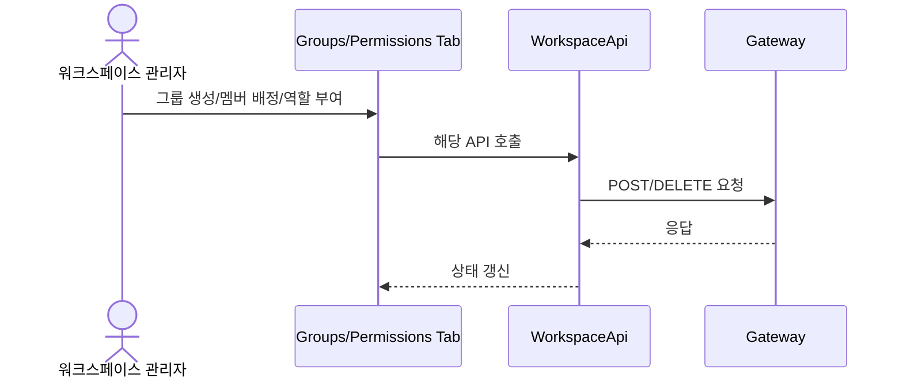
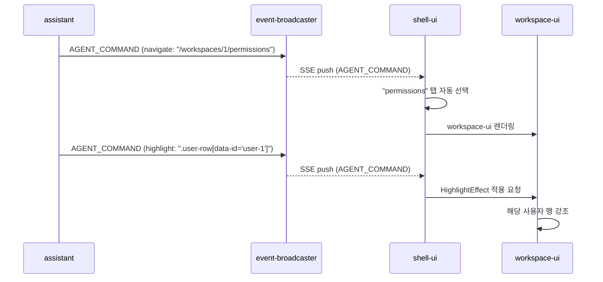

# Workspace-UI 유스케이스

## 워크스페이스 정보 수정 시퀀스

## 그룹 및 역할 관리 시퀀스

---

## UC-WM1: 워크스페이스 정보 수정
- **액터**: 워크스페이스 관리자
- **기능**: 워크스페이스의 메타데이터(이름, 설명)를 수정한다.
- **정상 흐름**:
    1. 관리자가 Info 탭에서 정보를 수정한다.
    2. "저장" 버튼을 클릭한다.
    3. 시스템이 `PUT /workspaces/{id}` API를 호출한다.
    4. 성공 시 목록을 최신화하고 성공 알림을 표시한다.

## UC-WM2: 그룹 생성 및 삭제
- **액터**: 워크스페이스 관리자
- **기능**: 워크스페이스 내 논리적 그룹을 관리한다.
- **정상 흐름**:
    1. 관리자가 Groups 탭에서 "그룹 추가"를 클릭한다.
    2. 이름을 입력하고 저장을 요청한다 (`POST /groups`).
    3. 삭제 시에는 ConfirmDialog 확인 후 `DELETE /groups/{id}`를 호출한다.

## UC-WM3: 사용자 배정
- **액터**: 워크스페이스 관리자
- **기능**: 특정 그룹에 사용자를 할당하거나 해제한다.
- **정상 흐름**:
    1. 관리자가 특정 그룹을 선택한다.
    2. 사용자 검색 후 "추가"를 클릭한다 (`POST /members`).
    3. 멤버 목록에서 "삭제"를 클릭하여 배정을 해제한다 (`DELETE /members`).

## UC-WM4: 권한 부여 (Role Assign)
- **액터**: 워크스페이스 관리자
- **기능**: 그룹에 표준 역할을 부여하여 권한을 할당한다.
- **정상 흐름**:
    1. 관리자가 Permissions 탭에서 그룹을 선택한다.
    2. 표준 역할(ADMIN, TYPE_MANAGER 등)을 선택한다.
    3. 해당 역할의 Permission 상세 목록을 미리보기로 확인한다.
    4. "역할 부여"를 확정한다 (`POST /roles`).

---

## 트레이서빌리티 매트릭스

| UC | 설명 | 상태 | 주요 클래스 |
|----|------|------|------------|
| UC-WM1 | 정보 수정 | 🚧 부분 구현 (API 완료, UI 진행 중) | InfoTabElement, WorkspaceApi |
| UC-WM2 | 그룹 관리 | 🚧 부분 구현 (API 완료, UI 미구현) | GroupsTabElement, WorkspaceApi |
| UC-WM3 | 사용자 배정 | 🚧 부분 구현 (API 완료, UI 미구현) | GroupsTabElement, WorkspaceApi |
| UC-WM4 | 권한 부여 | 🚧 부분 구현 (API 완료, UI 미구현) | PermissionsTabElement, WorkspaceApi |

## 에이전트 연동

### 시나리오 — 권한 설정 안내

