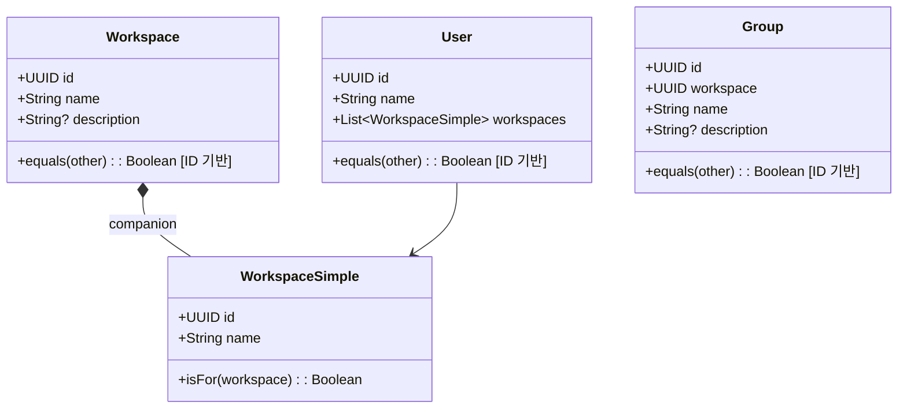

# Workspace 클래스 다이어그램

```mermaid
classDiagram
    class Workspace {
        +UUID id
        +String name
        +String? description
        +equals(other): Boolean [ID 기반]
    }

    class WorkspaceSimple {
        +UUID id
        +String name
        +isFor(workspace): Boolean
    }
    Workspace *-- WorkspaceSimple : companion

    class User {
        +UUID id
        +String name
        +List~WorkspaceSimple~ workspaces
        +equals(other): Boolean [ID 기반]
    }
    User --> WorkspaceSimple

    class Group {
        +UUID id
        +UUID workspace
        +String name
        +String? description
        +equals(other): Boolean [ID 기반]
    }
```
