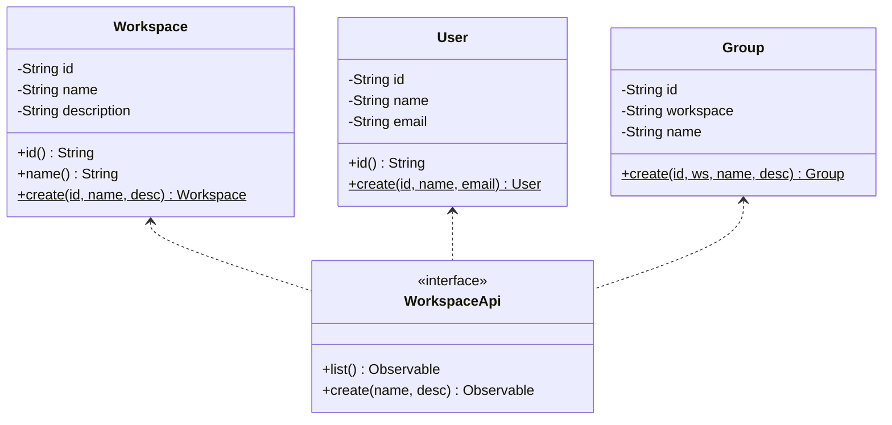

# Workspace 클래스 다이어그램

## 도메인 모델 (Shared)

```mermaid
classDiagram
    class Workspace {
        -String id
        -String name
        -String description
        +id() String
        +name() String
        +create(id, name, desc)$ Workspace
    }
    class User {
        -String id
        -String name
        -String email
        +id() String
        +create(id, name, email)$ User
    }
    class Group {
        -String id
        -String workspace
        -String name
        +create(id, ws, name, desc)$ Group
    }
    class WorkspaceApi {
        <<interface>>
        +list() Observable
        +create(name, desc) Observable
    }
    
    Workspace <.. WorkspaceApi
    User <.. WorkspaceApi
    Group <.. WorkspaceApi
```
